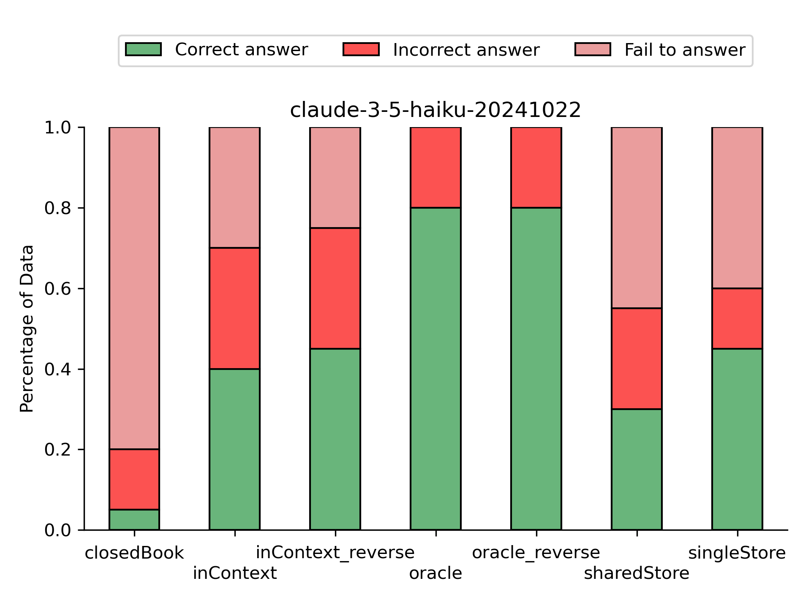
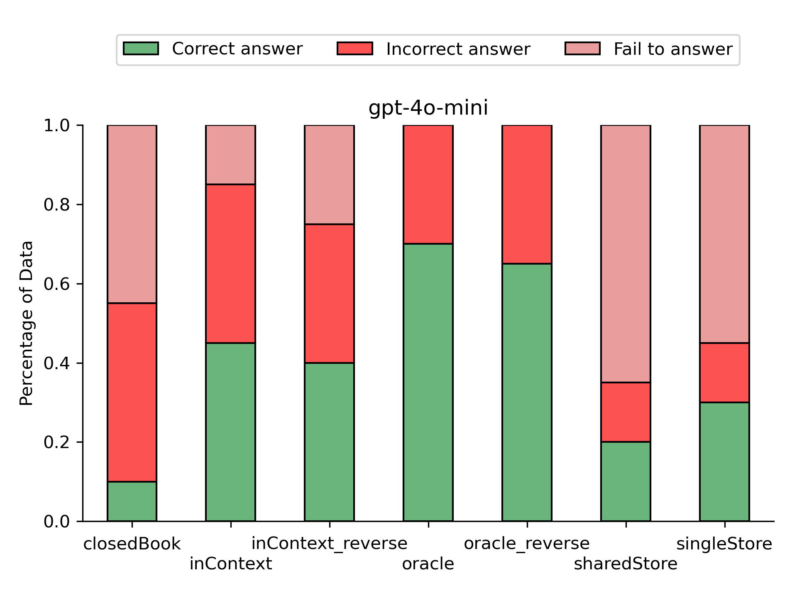

# Apply FinanceBench on GPT-4o-mini and Claude 3.5 Haiku

This project evaluate the performance of **GPT-4o-mini** and **Claude 3.5 Haiku** on open-book financial question answering using FinanceBench.

### Experiment setting

||Claude 3.5 Haiku|GPT-4o mini|
|-|-|-|
|Closed Book|all|all|
|Long Context|group 0|group 0|
|Long Context (Reverse)|group 0|all|
|Oracle|group 0|group 0|
|Oracle (Reverse)|group 0|group 0|
|Shared Store|group 0|group 0|
|Single Store|group 0|group 0|

Temperature (0.01) and max tokens (2048) are both same with FinanceBench setting.

Due to the time and usage constraint, espeacially the price of Claude 3.5, currently only group 0 (30 QAs) had all setting conducted, and only 20 of them are annotated.

P.S. Since there was only one annotator for this project and his financial knowlege was not extensive, the annotated result should be used with caution.

### Observation

    
    

There are 10 metrics-generated questions, 5 domain-relevant questions, and 5 novel-generated questions in the annotated set. 
 

The result is same as expectation, that Oracle setting with the unrealistic highest accuracy, Long Context with the second highest, Vector Store the third, and Close Book the last.

### Other

1. Future Study: I recorded the number of characters cut off from the regulating function in the In Context setup and found they are quite high. This make me wonder if the information that LLM need to answering question is also being cut off. LLM also often fail to find information with In Context setup. Thus, this could be the next study subject after finished testing and annotating whole dateset.

2. Data Error: The question financebench_id_00438 in data should use total revenue in justification, but subscription is recoreded instead.

### Project Structure Guide
As stated in commit, evaluation_playground.ipynb is split to 4 py script files, which are: 

    evaluation.py 
    model_api.py 
    gloabl_var.py 
    helper.py  

with main in `evaluation.py`.

The purposes of other py script are:  
    + `test_sleep.py` : Unit test of the sleep functions that prevent TPM and RPM reaching limit.  
    + `prepare_data.py` : Split orginal QA set to 5 groups, or merge partial of them to scale up QA.  
    + `results_manager.py` : Can split, merge, and sort results.  
    + `plot.py` : plot the data

### Reference
@misc{islam2023financebenchnewbenchmarkfinancial,
      title={FinanceBench: A New Benchmark for Financial Question Answering}, 
      author={Pranab Islam and Anand Kannappan and Douwe Kiela and Rebecca Qian and Nino Scherrer and Bertie Vidgen},
      year={2023},
      eprint={2311.11944},
      archivePrefix={arXiv},
      primaryClass={cs.CL},
      url={https://arxiv.org/abs/2311.11944}, 
}